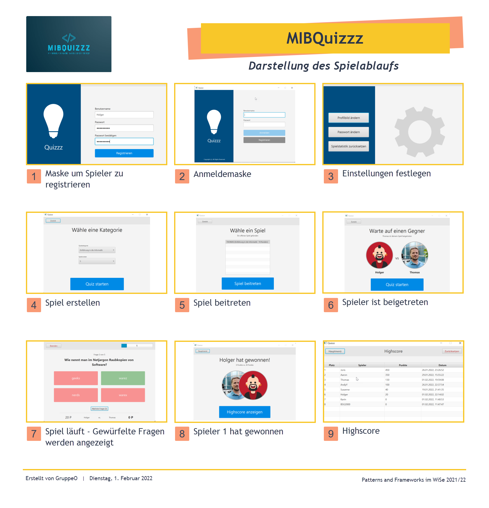

# MIBQuiz2021

Anbei finden Sie die wichtigsten Informationen zum Repository der **Gruppe O** (*Patterns and Frameworks* im WiSe
2021/22).

## Entwickler-Team:

* [Andreas Kissmehl](https://git.mylab.th-luebeck.de/andreas.kissmehl)
* [Jan Steinke](https://git.mylab.th-luebeck.de/jan.steinke)
* [Thomas Krohnfuß](https://git.mylab.th-luebeck.de/BSG2000)

## Projektbeschreibung

Im Rahmen der Aufgabenstellung haben wir uns entschieden ein **Multiplayer-Quiz** umzusetzen. Dabei handelt es sich um
eine Client-Server-Anwendung, welche in Java geschrieben ist. Neben dem Java-Spiel-Client gibt es eine Web-App, welche
in JavaScript geschrieben ist. Es ist möglich den Java-Client gegen die Web-App spielen zu lassen.

### Verwendete Frameworks und Technologien

Es folgt eine Auswahl der wichtigsten Frameworks und Technologien, welche jedoch nicht vollständig ist.

* **Server-App:** REST API ist mit Spring Boot (Spring-Framework) umgesetzt, JPA Hibernate, javax servlet, lombok, JWT (
  JSON Web Token)
* **Java-Spiel-Client:** JavaFX, lombok ... <-- @Jan Bitte ergänzen @ToDo
* **JavaScript-Spiel-Client:** Bootstrap, jQuery

### Tech-Stack

* **Container:** Docker
* **Datenbank:** MariaDB (Docker)
* **WebServer:** nginx für den JavaScript Client (Docker), Tomcat für die Spring REST API
* **Entwicklungsumgebung:** IntelliJ IDEA 2021.3 (Ultimate Edition)
* **Build-Werkzeug:** MAVEN
* **API Testwerkzeug:** Postman mit Team Workspace
* **DB-Administration:** Adminer (Docker)
* **Versionierung und Ticketing:** Gitlab der THL und New Relic (CodeStream)
* **Videokonferenzen:** MS-Teams

## Spielablauf

## Ordnerstruktur

Das Repository besteht aus folgenden Ordnern (hier sind nur die wichtigsten genannt):

    📦 Reop
    ┣ 📂 .mvn                Maven Wrapper
    ┣ 📂 doc                 Die ausgearbeitete Dokumentation und zugehörige Dateien.
    ┃ ┣ 📂 EA                Unterordner mit Daten zur Einsendeaufgabe
    ┃ ┣ 📂 Javadoc           Unterordner mit Javadoc
    ┃ ┣ 📂 img               Unterordner mit Bildern
    ┃ ┣ 📂 java_client       Unterordner mit Doku zur Client-App
    ┃ ┣ 📂 mockups           Unterordner mit ersten Entwürfen der Client-App
    ┃ ┣ 📂 notes             Unterordner mit Besprechungsnotizen
    ┃ ┣ 📂 postman           Unterordner für postman Vorlage
    ┣ 📂 lib                 Für die Anwendung benötigte Libraries
    ┣ 📂 META-INF            Für die Anwendung benötigte Einstellungen(?)
    ┣ 📂 src                 Unterordner für Source und die docker-compose.yml
    ┃ ┣ 📂 main              Hauptentwicklungszweig
    ┃ ┃ ┣ 📂 java            Daten der Java anwendungen
    ┃ ┃ ┃ ┗ 📂 de.gruppeo
    ┃ ┃ ┃ ┃ ┣ 📂 wise2122_java_client
    ┃ ┃ ┃ ┃ ┗ 📂 wise2122_java_server
    ┃ ┃ ┃ ┃ ┃ ┣ 📂 docker.mysql
    ┃ ┃ ┃ ┃ ┃ ┃ ┗📜 data.sql                 <- sql script für die Fragen und zwei User
    ┃ ┃ ┃ ┃ ┃ ┗ 📜 MibquizzzApplication.java <- corsConfigurer
    ┃ ┃ ┣ 📂 jswebclient                     Daten der Webapp
    ┃ ┃ ┗ 📂 resources
    ┣ 📂 target
    ┣ 📜 CONTRIBUTING.md
    ┣ 📜 LICENSE
    ┣ 📜 lombok.config
    ┣ 📜 pom.xml
    ┗ 📜 README.md

## Build-Prozess und Docker

*Hier sollte der o.g. Prozess beschrieben werden und ggf. sollte man ein paar Worte zu Docker verlieren*